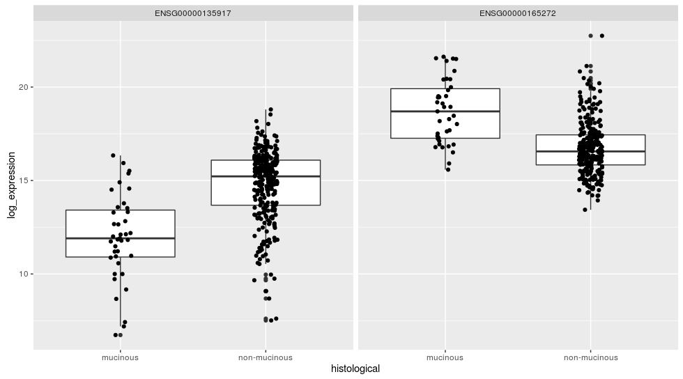

# Cancer Regulome Replication
  The [Cancer Regulome](http://www.cancerregulome.org/) published [Comprehensive molecular characterization of human colon and rectal cancer](http://www.nature.com/nature/journal/v487/n7407/full/nature11252.html) in Nature in 2012.  
  
  In Nature's [supplemental document](http://www.nature.com/nature/journal/v487/n7407/extref/nature11252-s1.pdf), the cancer regulome describes a per-gene aggression metric workflow. This workflow is roughly summarized as follows:
  
  1. Aggregate FPKM values from 

## Categorical Endpoint Counts

|         Clinical Endpoint|       value|Cases with Value| 
|-----------------|------------|-----|
|      binary tumor Stage| early stage|  183|
|      binary tumor Stage|  late stage|  142|
|     histological|non-mucinous|  286|
|     histological|    mucinous|   39|
|lymphatic Invasion|         YES|  129|
|lymphatic Invasion|          NO|  196|
|       metastasis|          M1|   56|
|       metastasis|          M0|  269|
| vascular Invasion|         YES|   84|
| vascular Invasion|          NO|  241|

## Two Sample T-Test

|target           |ensembl        |variable     |statistic|statistic_value     |
|-----------------|---------------|-------------|---------|--------------------|
|binaryStage      |ENSG00000214248|insignificant|t        |8.128193027125768E-6|
|binaryStage      |ENSG00000103510|maximum      |t        |5.374607145498855   |
|binaryStage      |ENSG00000104626|minimum      |t        |-6.1701089613902305 |
|histological     |ENSG00000165272|maximum      |t        |7.994211474898419   |
|histological     |ENSG00000135917|minimum      |t        |-8.313256114358273  |
|lymphaticInvasion|ENSG00000172469|maximum      |t        |5.613226571614891   |
|lymphaticInvasion|ENSG00000160951|minimum      |t        |-5.588819496996077  |
|metastasis       |ENSG00000122547|maximum      |t        |5.02823349202346    |
|metastasis       |ENSG00000002549|minimum      |t        |-6.063847096626741  |
|percentPosLymph  |ENSG00000183117|insignificant|pearson  |1.93306326762824E-6 |
|percentPosLymph  |ENSG00000261733|maximum      |pearson  |0.9968381869512126  |
|percentPosLymph  |ENSG00000275335|minimum      |pearson  |-0.995254938533587  |
|vascularInvasion |ENSG00000121940|maximum      |t        |4.686342882379625   |
|vascularInvasion |ENSG00000147889|minimum      |t        |-4.403239861754864  |

### Histologically mucinous vs non-mucinous
]
### Binary Tumor Stage

### Metastasis

### Lymphatic Invasion

### Vascular Invasion

## Fishers Continuous Transformation

## P-Value Synthesis

### Correlation

### Truncated Product Method

### Fishers Combined P-Value 

## Cancer Regulome - vs Fishers Combined

